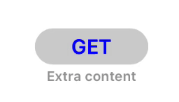

# DownloadingProgressButton

[](http://cocoapods.org/pods/DownloadingProgressButton)
[](http://cocoapods.org/pods/DownloadingProgressButton)
[](http://cocoapods.org/pods/DownloadingProgressButton)



## Installation

DownloadingProgressButton is available through [CocoaPods](http://cocoapods.org). To install
it, add the following line to your Podfile:

```ruby
pod "DownloadingProgressButton"
```

## Usage

You can use a `DownloadingProgressButton` on Storyboards

When the button is clicked, it will animate to pending rotation circle, inform you to start downloading and wait for downloading progress. You must implement delegate method:

```swift
func stateWasChanged(to newState: DownloadStates, sender: DownloadingProgressButton) {
    if newState == .pending {
        // MARK: perform some actions and inform button
        sender.downloadingStarted()
    }
}
// MARK: change downloading progress
button.downloadingProgressChanged(to: 0.2)
```
When this value reaches >= 1.0, then button is automatically animates to the end and takes done state.

To set or reset downloaded state:

```swift
button.downloadingSet()
button.downloadingReset()
```

To start animations programmatically:

```swift
button.startProgrammatically()
```

You can customize properties from Interface Builder:


## Example

To run the example project, clone the repo, choose Xcode 8 or Xcode 9 project and run `pod install` from the directory first.

## Requirements

Swift 3+

Xcode 8+

## Author

VAndrJ

## License

DownloadingProgressButton is available under the MIT license. See the LICENSE file for more info.

